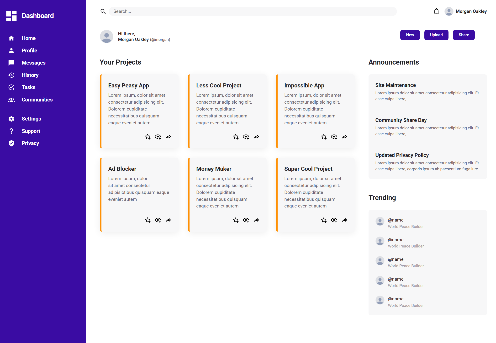
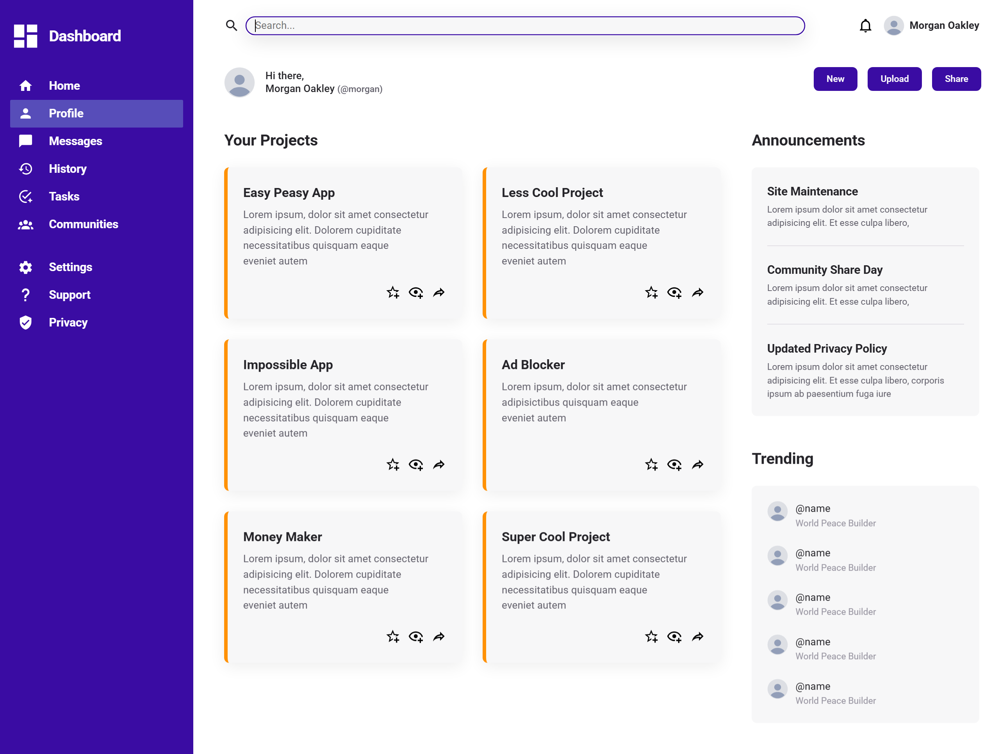

# Project

This is an admin dashboard created with CSS grid, subgrid and CSS flexbox. A design system has been set up as well the colors have been chosen.

Website: [Finished demo](https://simeon2002.github.io/TOP-admin-dashboard/)

# Takeaways

- At first, the structure was fully defined using the page-level grid on the `.container` wrapper class.
- However, I realized that this is a page-level layout structure and that the main content (project, announcement and trending section) need to have their own grid such that the content layout structure is independent of the page-level layout structure, hence I refactored the code
- The main reason for this was that I wanted to use `display: contents` to try it out.
- Fluidity has been created using grid.
- Further responsiveness can also be accomplished using media queries to adjust the layout, but this hasn't been done here.

So... The main conclusion here is that with `display: contents`, it works but it is better to use separate grids as to not mix section-level layout structure with page-level layout sturcture.

# Project Screenshots

